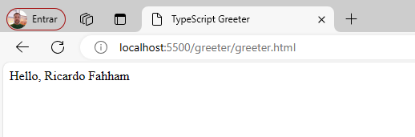

# projetos-typescript

TypeScript Cheatsheet

## Instalar o TypeScript via linux

```bash
npm install -g typescript
```

Changelog: https://github.com/npm/cli/releases/tag/v10.7.0

## Update da versão

```bash
npm install -g npm@10.7.0
```


## Instalar Node via linux

```bash
curl -fsSL https://deb.nodesource.com/setup_lts.x | sudo -E bash -
sudo apt-get install -y nodejs
```

## Verificar a versão do Node

```bash
node --version
v20.12.2
```

Verificar a versão do NPM

```bash
npm --version
v10.5.0
```

## Criando o arquivo greeter.ts

    function greeter(person) {
        return "Hello, " + person;
    }
    
    let user = "Ricardo Fahham";
    
    document.body.textContent = greeter(user);

## Criando o arquivo greeter.html

    <!DOCTYPE html>
    <html>
    <head>
        <title>TypeScript Greeter</title>
    </head>
    <body>
        <script src="greeter.js"></script>
    </body>
    </html>

## Buildando o códido do Typescript

```bash
tsc greeter.ts
```
Criará um arquivo greeter.js

## Acessar o html (Live Server)



## Documentação de apoio
https://media.licdn.com/dms/document/media/D4D1FAQEeOdurxEdy1w/feedshare-document-pdf-analyzed/0/1713405522752?e=1714608000&v=beta&t=X_mLDdYhytUZorIc3Kk86L2tf3IZSVXFae1k_vbmfus -->

https://www.typescriptlang.org/docs/handbook/typescript-in-5-minutes.html